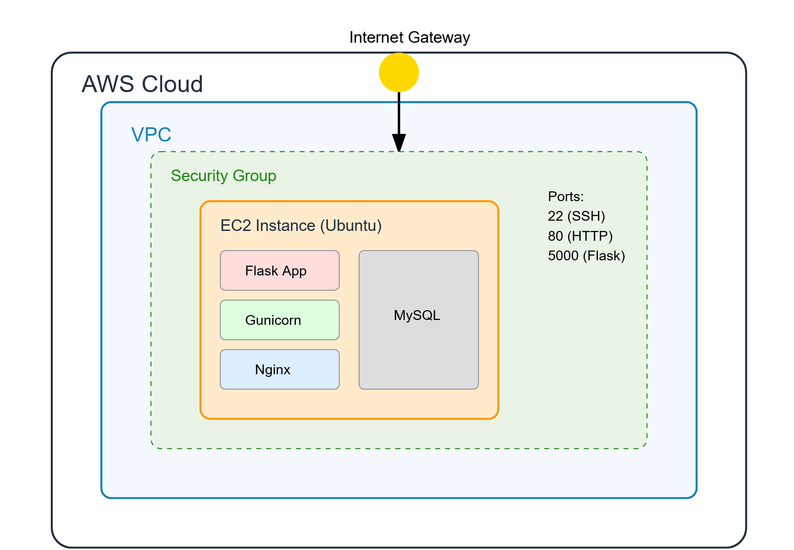

# charlie-assessment-2

# Flask Application Deployment Documentation

## System Architecture



## Prerequisites

- AWS account with appropriate permissions
- Terraform installed locally
- Ansible installed locally
- SSH key pair (`mikhail-east1.pem`)
- Flask-App located [here](https://github.com/mikhail-w/-todolist-flask)

## Project Structure

```
.
├── terraform/
│   └── main.tf
├── ansible/
│   ├── inventory.ini
│   └── setup_flask_app.yml
└── README.md
```

## Deployment Steps

### 1. Infrastructure Provisioning

```bash
# Initialize Terraform
cd terraform
terraform init

# Deploy infrastructure
terraform plan
terraform apply
```

### 2. Configure Ansible Control Node

Update `inventory.ini` with the EC2 instance's public IP (output from
Terraform):

```ini
[webserver]
<EC2_PUBLIC_IP> ansible_user=ubuntu ansible_private_key_file=/home/mikhail/.ssh/mikhail-east1.pem ansible_python_interpreter=/usr/bin/python3
```

### 3. Deploy Application

```bash
# Run Ansible playbook
cd ../ansible
ansible-playbook -i inventory.ini setup_flask_app.yml
```

## Verification Steps

1. SSH into instance:

```bash
ssh -i ~/.ssh/mikhail-east1.pem ubuntu@<EC2_PUBLIC_IP>
```

2. Check services:

```bash
# Verify MySQL
sudo systemctl status mysql

# Verify Flask application
sudo systemctl status todoapp

# Check application logs
sudo journalctl -u todoapp
```

3. Access application:

- Open browser: `http://<EC2_PUBLIC_IP>:5000`

## Security Notes

- MySQL credentials are stored in Ansible playbook
- SSH key required for EC2 access
- Application runs on port 5000
- Security group allows SSH (22), HTTP (80), and Flask app (5000) traffic

## Cleanup

```bash
# Destroy infrastructure
cd terraform
terraform destroy
```
